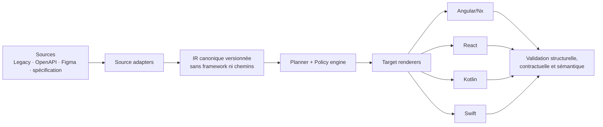

# Audit du système de génération générique multi-source/multi-stack

- **Date :** 2026-08-14
- **Périmètre :** `cmz-platform`, architecture Angular/Nx, corpus, patterns,
  adaptateur SEOS, générateur de référence, oracles et chaîne de validation.
- **Méthode :** lecture du code et des contrats, mesures statiques, exécution des
  principaux gates, builds et tests. Les conclusions distinguent explicitement
  la vision documentée de ce qui est exécutable aujourd'hui.
- **État du worktree :** `docs/architecture/scope.json` était déjà modifié au
  début de l'audit. Cette modification n'a pas été altérée.

---

## 1. Verdict exécutif

Le projet est un **très bon monolithe modulaire Angular/Nx** et une solide
référence de rétro-ingénierie SEOS. Il ne constitue cependant **pas encore un
système générique multi-source/multi-stack exécutable**.

La généricité existe principalement sous forme de vision, de documentation et
de taxonomie. L'implémentation réelle reste :

- centrée sur une source legacy TypeScript/Angular ;
- fortement couplée à Angular, Nx et à la structure SEOS ;
- assistée par agent plutôt que pilotée par un moteur déterministe ;
- validée surtout par la présence de fichiers et la compilation, et non par
  l'équivalence fonctionnelle.

| Dimension                              | Note     | État                              |
| -------------------------------------- | -------: | --------------------------------- |
| Architecture Angular/Nx                | 7,5/10   | Solide                            |
| Documentation et formalisation         | 8/10     | Très riche                        |
| Oracles et gates effectifs             | 4,5/10   | Fragiles                          |
| Génération legacy vers Angular         | 3,5/10   | Prototype assisté                 |
| Multi-source/multi-stack livré         | 2/10     | Vision, pas plateforme            |
| Potentiel architectural                | 7/10     | Réel, avec refonte du noyau       |

La formulation fidèle au niveau de maturité est donc :

> **Implémentation de référence Angular/SEOS validée, avec architecture de
> générateur multi-source/multi-stack en construction.**

---

## 2. Ce qui est réellement construit

### 2.1 Un socle Angular/Nx sérieux

Le dépôt possède de bonnes fondations d'ingénierie :

- séparation `domain / data / application / ui` ;
- contraintes Nx strictes de type et de périmètre dans `eslint.config.mjs` ;
- lazy loading et guards correctement structurés dans
  `apps/backoffice-angular/src/app/app.routes.ts` ;
- 72 bibliothèques et une application ;
- pureté du domaine confirmée : 1 068 fichiers inspectés dans les bibliothèques
  contrôlées, sans import ni décorateur Angular ;
- lint réussi sur les 73 projets ;
- compilation Angular stricte avec `ngc` réussie ;
- 47 cibles de tests réussies, dont 14 fichiers et 57 tests pour l'application.

Cette qualité est importante : le problème n'est pas l'absence de discipline
Angular. Le problème se situe à la frontière entre une excellente cible Angular
et un véritable moteur de génération indépendant des sources et des cibles.

### 2.2 Le flux de génération reste assisté par agent

`docs/architecture/generation-from-patterns.md` décrit explicitement la
génération du contenu comme une opération réalisée par un agent, avec les skills
Angular et le legacy, fichier ou nœud par fichier ou nœud.

Ce processus est utile pour une migration contrôlée, mais il ne fournit pas
encore les propriétés d'une plateforme de génération :

- fonction de transformation versionnée ;
- entrée et sortie structurées ;
- déterminisme ;
- idempotence ;
- diagnostic typé des données manquantes ;
- reproductibilité sans intervention cognitive de l'agent.

### 2.3 Le générateur exécutable est un cas de référence fixe

`tools/seos/generate-reference-module.mjs` génère un module CRUD de référence
orienté `resources`. Il démontre la faisabilité d'une génération mécanisée,
mais ne constitue pas encore un registre générique de patterns ou de renderers.

`tools/seos-adapter/adapt.mjs` injecte directement :

- des dépendances Angular et RxJS ;
- une organisation de packages Nx ;
- des conventions de fichiers propres à la cible actuelle.

L'adaptateur transforme donc le legacy vers **une cible Angular/Nx**, et non
vers une représentation intermédiaire indépendante de la cible.

### 2.4 Les autres sources et stacks sont documentées, non démontrées

La conception du pipeline Figma est explicitement déclarée non implémentée dans
`docs/architecture/conception-pipeline-figma-vers-code.md`. React reste un axe
de preuve de concept documenté ; Kotlin et Swift ne disposent pas encore de
renderer exécutable.

La promesse figurant dans le `README.md` doit par conséquent être lue comme une
cible de plateforme et non comme une capacité livrée.

---

## 3. Analyse du corpus et des oracles

### 3.1 Le corpus est un index de migration

Mesures sur les 1 507 entrées réparties dans 18 modules :

| Mesure                                      | Valeur            |
| ------------------------------------------- | ----------------: |
| Entrées totales                             | **1 507**         |
| `status: verified`                          | **585**           |
| `status: n/a`                               | **922**           |
| Entrées contenant source/cible/diff/hash    | **0**             |
| Entrées comportant des oracles              | **1 313**         |

Le schéma `docs/architecture/corpus/pair.schema.json` modélise principalement
un chemin `legacy` et un chemin `nx`. Il ne contient ni représentation
intermédiaire, ni transformation, ni contenu, ni preuve d'équivalence.

Le corpus est donc précieux comme :

- index de traçabilité ;
- inventaire de correspondances ;
- registre des décisions de non-reproduction ;
- matière pour analyser les conventions de rangement.

Il ne constitue pas encore un jeu de données autoporteur permettant
d'apprendre, rejouer ou vérifier une transformation sémantique.

### 3.2 Les DTO sont inférés de la cible

`docs/architecture/schema/dto.schema.json` indique lui-même que le contrat est
reconstruit à partir du TypeScript, sans validation par OpenAPI, backend ou
trafic réel.

Cette approche permet de formaliser l'existant, mais elle crée un risque de
validation circulaire : la cible générée est contrôlée par un contrat inféré de
la même famille de code.

### 3.3 Les gates vérifient majoritairement la forme

`tools/check-pattern-nx.mjs` précise que le contrôle vérifie la présence des
artefacts, pas leur contenu ni leur sémantique.

Un oracle vert établit donc surtout :

- que le fichier attendu existe ;
- qu'il se trouve au bon emplacement ;
- que sa forme générale respecte certaines conventions ;
- qu'il compile ou passe le lint lorsque ces cibles sont câblées.

Il ne démontre pas nécessairement :

- l'équivalence métier avec le legacy ;
- la fidélité des effets de bord ;
- les règles d'autorisation ;
- le comportement sur erreurs et états limites ;
- l'équivalence des contrats backend.

La phase d'équivalence fonctionnelle est d'ailleurs encore déclarée non
commencée dans `docs/architecture/generation-from-patterns.md`.

---

## 4. Défauts et risques prioritaires

### P0-1 — `check-project-targets` interprète mal la sortie Nx

`tools/check-project-targets.mjs` exécute `nx show projects
--with-target=<target>`, découpe la sortie par lignes puis considère chaque ligne
comme un nom de projet.

Avec Nx 23.1, la commande renvoie un tableau JSON sur une seule ligne :

```text
["@cmz/core", "@cmz/shared-domain", ...]
```

Le checker traite le tableau complet comme un seul projet et signale à tort que
les 72 bibliothèques n'ont ni cible `build` ni cible `lint`, soit 144 violations.
La lecture individuelle d'un projet par Nx confirme pourtant que les deux
cibles existent.

**Impact :** `check:all` produit un faux échec et ne peut pas servir de preuve
de santé globale.

**Correction attendue :** parser d'abord la sortie avec `JSON.parse` lorsqu'il
s'agit d'un tableau, conserver un fallback ligne par ligne, puis couvrir les
deux formats par des tests unitaires.

### P0-2 — Le validateur du pattern core n'est pas câblé

`docs/architecture/patterns/validate-pattern-core.mjs` existe, mais n'est appelé
ni par `package.json`, ni par les workflows CI, ni par les hooks inspectés.

Une régression de la composition core peut donc entrer dans le dépôt pendant
que tous les gates annoncés restent verts.

### P0-3 — Le validateur ne contrôle pas `CORE_VERBS`

Le validateur charge le schéma, valide les objets de patterns et certaines
références, mais ne valide pas `schema.CORE_VERBS` contre `$defs.verbRegistry`.

Une incohérence réelle est présente : `compositeRead.placeholders` déclare
`{MODULE}`, `{module}`, `{SECTION}` et `{section}`, alors que ses templates
emploient aussi `{section-kebab}`.

Le validateur annonce néanmoins les quatre patterns comme valides.

Le schéma racine conserve par ailleurs `additionalProperties: true`, ce qui
laisse une partie importante de la structure historique non contrainte.

**Correction attendue :**

1. valider le registre des verbes lui-même ;
2. vérifier tous les placeholders employés et déclarés ;
3. vérifier l'existence des champs référencés par `files_field` ;
4. faire échouer toute référence non résolue ;
5. ajouter des fixtures négatives intentionnellement invalides.

### P0-4 — Le build de livraison n'est pas reproductible localement

Avec la version Node attendue par le dépôt, les 72 bibliothèques compilent. Le
build applicatif échoue toutefois : le build de développement reproduit un
deadlock fatal dans esbuild ; le build de production s'interrompt également.

Ce résultat ressemble davantage à un problème de toolchain ou de builder qu'à
une erreur applicative :

- `ngc` strict réussit ;
- la construction du bundle de tests réussit ;
- les tests applicatifs passent.

Il demeure néanmoins un bloqueur de release tant qu'un build hermétique ne peut
pas être reproduit en local et en CI.

### P1-1 — Une moitié des projets n'a pas de tests effectifs

Sur les 73 projets :

- 26 n'ont aucune cible de test ;
- 11 possèdent une cible de test, mais aucun fichier de test ;
- `tools/vitest-lib.config.ts` active `passWithNoTests: true`.

Ainsi, 37 projets sur 73, soit environ 50,7 %, n'ont pas de spécifications
effectivement exécutées. Aucun seuil global de couverture n'est imposé.

Le fichier `coverage/lcov.info` observé ne couvre que 12 fichiers et ne doit pas
être présenté comme une mesure globale du dépôt.

### P1-2 — `check:ci-wiring` est sensible aux faux positifs textuels

Le contrôle recherche des chaînes de caractères dans les workflows, sans
interpréter réellement la structure YAML et les commandes exécutées. Une
occurrence dans un commentaire peut donc satisfaire le contrôle sans que le
gate soit effectivement lancé.

### P1-3 — Le dashboard local n'est pas couvert par un pattern

Dans l'état du worktree audité, `scope.json` contient `dashboard/dashboard`
comme `read-only-view`. `check-pattern-nx-coverage.mjs` couvre alors 9 des 10
cas `read-only-view` ; le dashboard reste absent de la couverture.

Ce constat décrit l'état local observé et non nécessairement l'état du dernier
commit.

---

## 5. Problème architectural fondamental

Le core actuel mélange encore deux niveaux qui doivent être séparés :

1. **le sens métier** : entités, commandes, requêtes, workflows, validations,
   permissions, intentions d'interface ;
2. **la projection technique** : chemins `libs/...`, facades, components,
   suffixes de fichiers et conventions Angular/Nx.

Les templates du core encodent explicitement des chemins et noms propres à
Angular/Nx. Le modèle présenté comme intermédiaire connaît donc déjà sa cible.

Cette fuite d'abstraction entraîne trois conséquences :

- chaque nouvelle stack impose des exceptions dans le core ;
- la taxonomie grossit pour représenter des détails de rendu ;
- les règles métier et les règles de packaging deviennent difficiles à tester
  indépendamment.

Le noyau canonique doit être dépourvu de chemins et de concepts de framework.
Les conventions Angular/Nx doivent vivre dans un renderer cible.

---

## 6. Architecture cible recommandée



### 6.1 `generator-core`

Responsable d'une IR métier canonique et versionnée :

- agrégats et entités ;
- commandes, requêtes et événements ;
- états et transitions de workflows ;
- invariants et validations ;
- ports et capacités requises ;
- permissions ;
- intention d'interface, sans composants spécifiques à une stack.

Chaque élément devrait porter :

- un identifiant stable et déterministe ;
- sa provenance ;
- son niveau de confiance ;
- les ambiguïtés non résolues ;
- les décisions humaines associées ;
- la version du schéma.

### 6.2 `source-spi`

Contrat commun des adaptateurs :

- legacy TypeScript/Angular ;
- OpenAPI ;
- spécification YAML ou JSON ;
- Figma ;
- éventuellement traces d'exécution ou documentation textuelle.

Chaque source déclare les faits qu'elle peut produire et leur fiabilité. Figma,
par exemple, fournit principalement structure visuelle, tokens et interactions
apparentes, mais peu de règles métier fiables.

### 6.3 `target-spi`

Contrat des renderers Angular, React, Kotlin et Swift. Chaque renderer déclare :

- les capacités qu'il exige de l'IR ;
- son profil de fichiers et de packages ;
- ses conventions de DI, état, navigation et tests ;
- les validateurs applicables à sa sortie.

Les chemins et suffixes de fichiers appartiennent exclusivement à cette couche.

### 6.4 `policy-engine`

Le moteur de politiques porte les règles indépendantes du framework :

- frontières de modules ;
- dépendances permises ;
- exigences de sécurité ;
- accessibilité ;
- confidentialité ;
- qualité minimale et couverture attendue.

Chaque stack peut ensuite fournir un mécanisme d'application différent : ESLint
pour TypeScript, règles Gradle/Detekt pour Kotlin, SwiftLint ou plugins SwiftPM
pour Swift.

### 6.5 `orchestrator`

Pipeline déterministe :

```text
ingérer → normaliser → valider l'IR → planifier → rendre → vérifier → diagnostiquer
```

Une information requise mais absente doit produire un diagnostic typé et
bloquant. Le système ne doit jamais inventer silencieusement une règle métier.

---

## 7. Analyse cognitive

### 7.1 Substitution de métrique

Le nombre de patterns, de paires, d'oracles ou de gates verts peut devenir un
substitut à l'objectif réel : reproduire correctement le comportement métier.

Le risque suit la loi de Goodhart : dès qu'une mesure devient l'objectif, elle
cesse progressivement d'être une bonne mesure. Ici, un fichier peut exister,
compiler et respecter le bon nom tout en implémentant un comportement erroné.

### 7.2 Validation circulaire

Les sources, les patterns, les DTO reconstruits et la cible proviennent du même
écosystème Angular/SEOS. Cette boucle démontre une cohérence interne, mais pas
une généricité externe.

Une preuve crédible nécessite au moins une source indépendante et une cible
dont les idiomes contredisent ceux d'Angular.

### 7.3 Fuite d'abstraction

Le modèle est dit générique, mais encode des chemins, facades et components
Angular/Nx. Le vocabulaire du core décrit ainsi déjà son renderer historique.

Cette fuite est cognitivement dangereuse : ce qui est familier paraît neutre.
Les choix Angular deviennent invisibles parce qu'ils sont devenus les conventions
du projet.

### 7.4 Biais de confirmation

La majorité des gates cherche à confirmer que la sortie possède la forme
attendue. Peu de tests tentent de falsifier les hypothèses : source incomplète,
stack sans DI par classes, erreurs backend contradictoires, workflow ambigu ou
mutation volontaire du comportement.

### 7.5 Généricité déclarative

Le vocabulaire de plateforme précède la deuxième source et le deuxième renderer
réels. Cela expose le projet à une forme d'architecture spéculative : le modèle
se complexifie avant d'avoir rencontré les contraintes qui doivent réellement
le généraliser.

L'antidote est une matrice de preuves exécutable, non une couche documentaire
supplémentaire.

---

## 8. Feuille de route priorisée

### P0 — Rétablir la confiance dans les preuves

1. Corriger le parsing JSON de `check-project-targets` et ajouter des tests de
   non-régression.
2. Brancher `validate-pattern-core` dans `check:all` et dans la CI.
3. Valider `CORE_VERBS`, les placeholders, les champs référencés et les
   références non résolues.
4. Traiter explicitement la couverture du pattern dashboard.
5. Diagnostiquer et figer la toolchain de build applicatif.
6. Remplacer progressivement les contrôles de simple présence par des
   validations AST, des contrats et des golden files.

### P1 — Extraire un véritable noyau de génération

Créer les frontières suivantes :

- `generator-core` : IR métier canonique ;
- `source-spi` : contrat des adaptateurs source ;
- `target-spi` : contrat des renderers ;
- `policy-engine` : règles indépendantes des frameworks ;
- `orchestrator` : pipeline de génération et de vérification.

La première règle d'architecture doit être testable automatiquement :

> `generator-core` ne contient aucun chemin, suffixe de fichier, import de
> framework ou concept propre à Angular, React, Kotlin ou Swift.

### P2 — Prouver la généricité sur un vertical slice

Choisir un pattern réduit, par exemple `action-request`, et construire une
matrice minimale :

|                     | Angular/Nx | React |
| ------------------- | :--------: | :---: |
| Legacy TypeScript   |     ✅      |   ✅  |
| Spécification YAML  |     ✅      |   ✅  |

Conditions de réussite :

- les deux sources produisent la même IR canonique à sémantique équivalente ;
- les deux cibles partent de cette IR, sans branchement spécifique à la source ;
- les sorties sont déterministes et couvertes par des golden tests ;
- les règles métier sont vérifiées par tests de contrats ou comportementaux ;
- les informations manquantes produisent des diagnostics structurés.

Il est déconseillé de commencer cette preuve par Figma. Figma exprime bien la
présentation, mais insuffisamment les invariants métier, permissions et contrats
backend. Une source YAML/OpenAPI permettra de stabiliser le modèle canonique
avant d'intégrer l'incertitude visuelle.

### P3 — Étendre seulement après falsification

Après réussite de la matrice minimale :

1. ajouter Figma comme source partielle, avec provenance et confiance ;
2. ajouter Kotlin ou Swift comme troisième renderer ;
3. mesurer la quantité d'exceptions spécifiques aux stacks ;
4. refuser toute extension qui nécessite de réintroduire des détails de cible
   dans l'IR canonique.

---

## 9. Critères de sortie du statut « prototype »

Le système pourra raisonnablement être qualifié de plateforme générique lorsque
les critères suivants seront simultanément vrais :

- au moins deux sources indépendantes sont exécutables ;
- au moins deux renderers indépendants sont exécutables ;
- le core ne dépend d'aucune convention de source ou de cible ;
- la génération est déterministe et rejouable ;
- les artefacts produits possèdent une traçabilité jusqu'aux faits source ;
- les inconnues et ambiguïtés sont explicites ;
- les gates valident la sémantique et pas seulement la structure ;
- une mutation volontaire du comportement est détectée ;
- le build et les tests sont reproductibles dans un environnement hermétique.

---

## 10. Conclusion

Le dépôt est une **base Angular de qualité** et un **laboratoire architectural
sérieux**. Il possède déjà plusieurs éléments utiles à une future plateforme :
taxonomie de patterns, séparation en couches, corpus de traçabilité, oracles,
contrats et discipline de documentation.

La prochaine étape n'est toutefois pas d'ajouter davantage de patterns ou de
sources théoriques. Elle consiste à :

1. rendre les preuves existantes fiables ;
2. extraire une IR véritablement neutre ;
3. démontrer cette neutralité sur deux sources et deux stacks contradictoires.

La généricité doit alors devenir **falsifiable, déterministe et démontrée**, et
non seulement déclarée.
